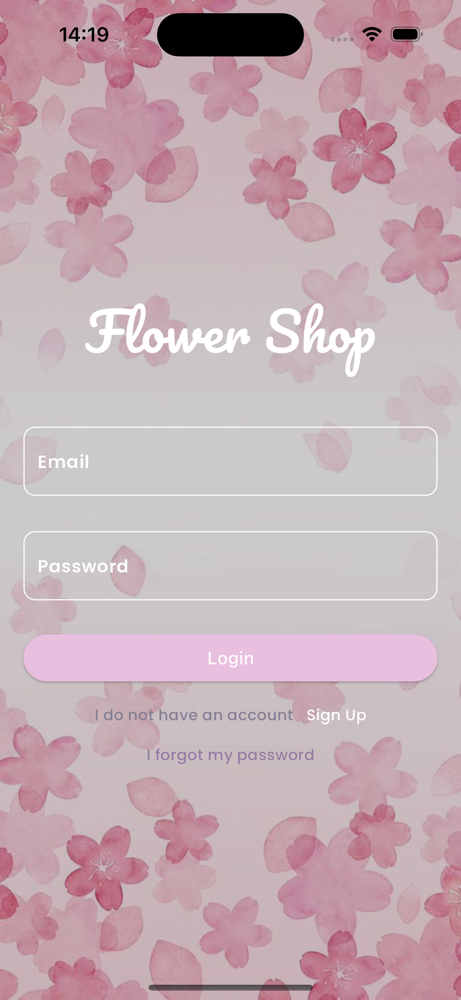
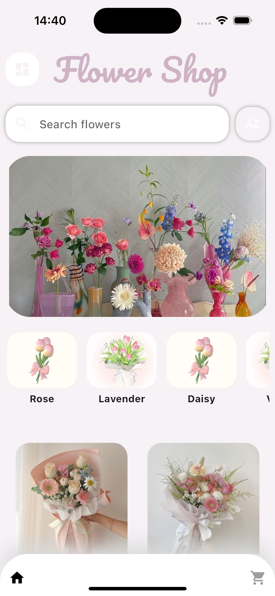

# Flower Shop

A Flutter-based mobile application that allows users to browse, favorite, and purchase flowers with a clean and elegant UI.

## Features
- Sign In / Sign Up – Secure user authentication  
- Home Slider – Highlights featured products  
- Category Listing – Browse flowers by category  
- Product Details – Detailed product view with description and price  
- Favorites – Users can save and view favorite products  
- Responsive UI – Works on both iOS and Android  
- Smooth Navigation – Drawer menu and bottom navigation bar

## Screenshots

  
  

## Tech Stack
- Flutter – UI framework  
- Dart – Programming language  
- Firebase (optional) – Authentication and data storage  
- Google Fonts – Typography  
- Material Design – UI components and theme

